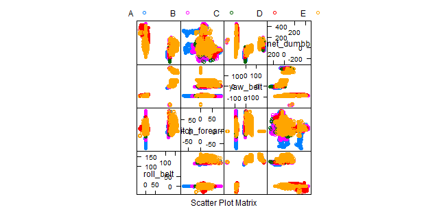
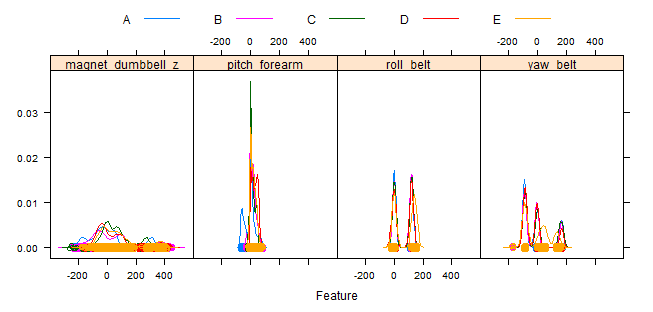
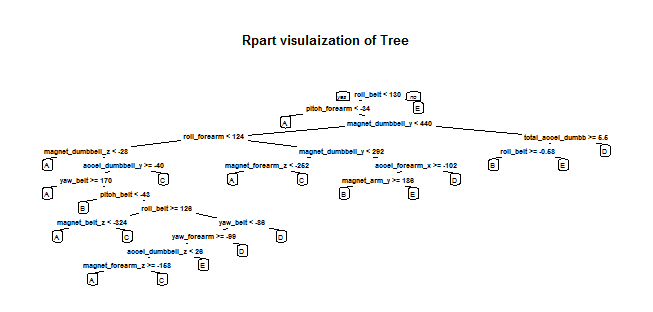
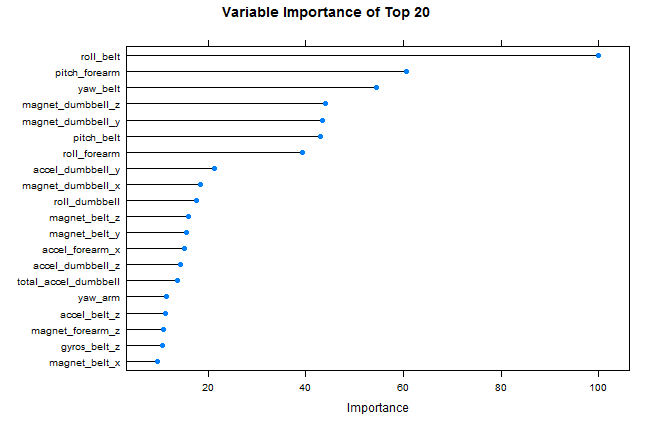
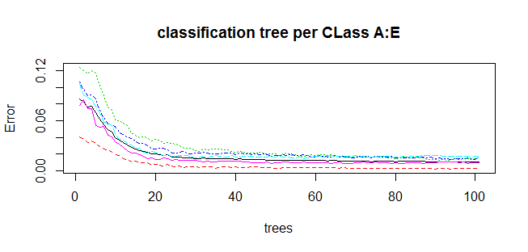

# Practical ML Project 
The goal of this project is to use data from accelerometers on the belt, forearm, arm, and dumbbell of 6 participants to quantify how well they are doing a particular activity. This is based on onen or public dataset made available
## Files 
The R source code and data are in one folder. The main program is FinalRun.R . This has avariable for the working directry and assumes raw data file are in same directory
```
# Set workspace. Change for Your machine
WorkingDir="~/GitHub/PracticalML"
# Read data in  
setwd(WorkingDir)
pml.training <- read.csv("pml-training.csv") # 19622 rows of 160 columns
pml.testing <- read.csv("pml-testing.csv") # 20 rows of 160 Variables
```
## Data Massaging
Based on eploratory work with reviewing the data in the training set we saw the following

 1.  159 varaiables + *dependant* variable **classe**
 2.  Book keeping variables 1-5 and 7
 3.  Variables with many *missing values* ( 87 columns only are left after pruning for NA)
 4. Non NUmeric (factors) were also pruned as well as Near Zero Value 
 5. Pruned to 52 variables
 6. Naive Bayesian etc were used to explore variable importance
 7. We would have used PCA if variables had been large but 52 is managable directly
 8. Since the data set is limited to 6 subjects we explored Random Forest as a more robust method
 
### Some Exploratory Graphs of the data
We exolored the dats thru 4 variables: roll_belt pitch_forearm yaw_belt magnet_dumbbell_z





## Sample results
*Fitted Random Forest has 99.5% accuracy and stable.
We Used 3 fold cross validation and mtry of 27 was optimum. Run time around 4 minutes. We also ran with 10 Fold CV which takes around 1 hour and gives similar results.


### ModelFit Final Model Output
```
Random Forest 

11776 samples
   52 predictor
    5 classes: 'A', 'B', 'C', 'D', 'E' 

No pre-processing
Resampling: Cross-Validated (3 fold) 
Summary of sample sizes: 7851, 7851, 7850 
Resampling results across tuning parameters:

  mtry  Accuracy   Kappa      Accuracy SD  Kappa SD   
   2    0.9841205  0.9799096  0.002419124  0.003058121
  27    0.9845447  0.9804460  0.001558626  0.001973528
  52    0.9737600  0.9668013  0.003255349  0.004123666

Accuracy was used to select the optimal model using  the largest value.
The final value used for the model was mtry = 27.

See ModFit Output_3.txt for 3 fold run stats and ModelFit Output_10.txt for 10 fold stats

```
### Confusion MAtrix 
```
Overall Statistics
                                          
               Accuracy : 0.9932          
                 95% CI : (0.9912, 0.9949)
    No Information Rate : 0.2845          
    P-Value [Acc > NIR] : < 2.2e-16       
                                          
                  Kappa : 0.9915          
 Mcnemar's Test P-Value : NA 
 
 ```
 See ConfusionMatrix_3.txt for 3 fold run stats and ConfusionMatrix_10.txt for 10 fold stats
 
### Tree Visualization
 
 
 
### Important Variables


 
### Stability
 
 We ran the model with various parameters as run time on our machine was under 4 minutes for most cases. The model is stable and Model errors quickly converge . We ran it for 3 fold CV and also ran it for 10 fold CV which is reported in the literature as a robust estimate. This took around 1 hour on our machine. We have enclosed results for both 3 and 10 fold .



### Out of sample error estimates
 Misclassification is 1- Accuracy
 For 3 fold CV Avg accuracy reported was 99.46% ie misclassification => 0.6%
 For 10 fold CV avg accuracy reported was 98.89% ie misclassification => 1.2%
 So we estimate mis classification at under 2% as *actual will be worse then estimate*.
 
### Prediction 
Prediction for the 20 observation are enclosed in predict.csv
Read into R with
~~~

In<-read.csv("predict.csv",row.names=1)

~~~
Individial files as required by submission are in sub directory OutPut.
The predictions are
B  A  B  A  A  E  D  B  A  A  B  C  B  A  E  E  A  B  B  B 
 